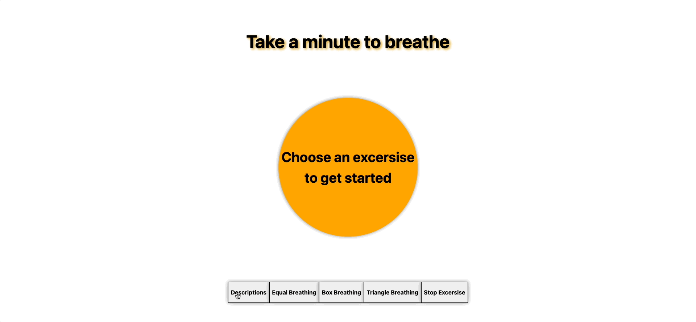

# Just Breathe

### Table of Contents

1. [General Info](#🌴-General-Info)
2. [Technologies](#🧪-Technologies)
3. [Installation](#🚀-Installation)
4. [Contributors](#🤝-Contributors)

### General Info

* An easy to use, minimalist breathing exercise web app with multiple exercise options



### 🧪 Technologies

* React
* CSS Animations
* Node
* Express
* AWS Ec2

🚀 Installation and Setup
```
$ git clone https://github.com/jasonadams1326/Just-Breathe.git
$ cd Just-Breathe/
$ npm install
$ npm start
$ open local host port 3000 to view app
```

### 🤝 Contributor

- [Jason Adams](https://www.linkedin.com/in/jason-adams-b88086146/)


